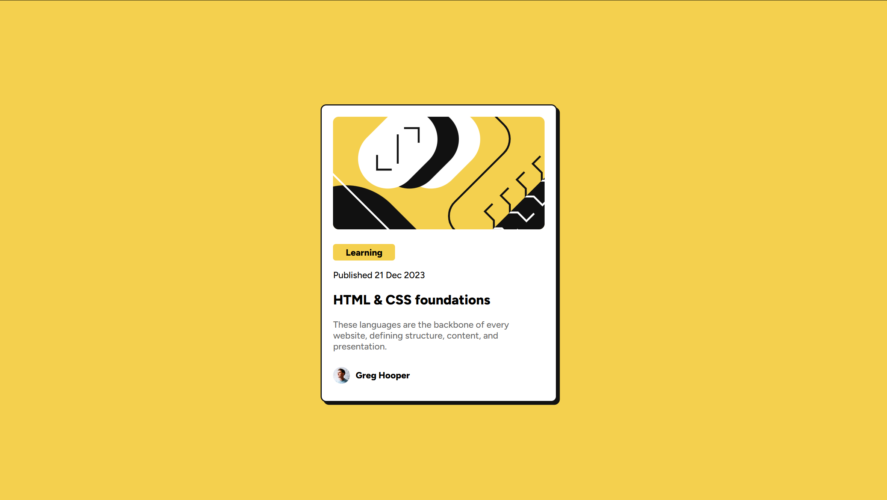

# Frontend Mentor - Blog preview card solution

This is a solution to the [Blog preview card challenge on Frontend Mentor](https://www.frontendmentor.io/challenges/blog-preview-card-ckPaj01IcS). Frontend Mentor challenges help you improve your coding skills by building realistic projects. 

## Table of contents

- [Overview](#overview)
  - [The challenge](#the-challenge)
  - [Screenshot](#screenshot)
  - [Links](#links)
- [My process](#my-process)
  - [Built with](#built-with)
  - [What I learned](#what-i-learned)
  - [Continued development](#continued-development)
  - [Useful resources](#useful-resources)
- [Author](#author)
- [Acknowledgments](#acknowledgments)

## Overview
This is my solution to the Blog preview card challenge. Looking at other people's code I can tell that my code is not very sophisticated. But I am a beginner at this, so I think I am ok with that. I will keep adding more of the things that I learn to my solutions as I go along. 

### The challenge

Users should be able to:

- See hover and focus states for all interactive elements on the page

### Screenshot

### Links

- Solution URL: [Add solution URL here](https://github.com/aevaksnes/blog-preview-card-main/tree/master)
- Live Site URL: [Add live site URL here](https://aevaksnes.github.io/blog-preview-card-main/)

## My process

I put together the HTML elements and then tried to replicate the design using CSS. I was looking into different ways to add the custom fonts. I noticed that it was already downloaded into the project files, so I wanted to use the files. 

### Built with

- Semantic HTML5 markup
- CSS custom properties
- Flexbox

### What I learned

I learned more about fonts. 

### Continued development

Looking at other peoples solutions, I see that I can still work with variables in my CSS, to make it more sophisticated. 

### Useful resources

VSCode together with Copilot was very helpful.

## Author

Eva

## Acknowledgments

Copilot